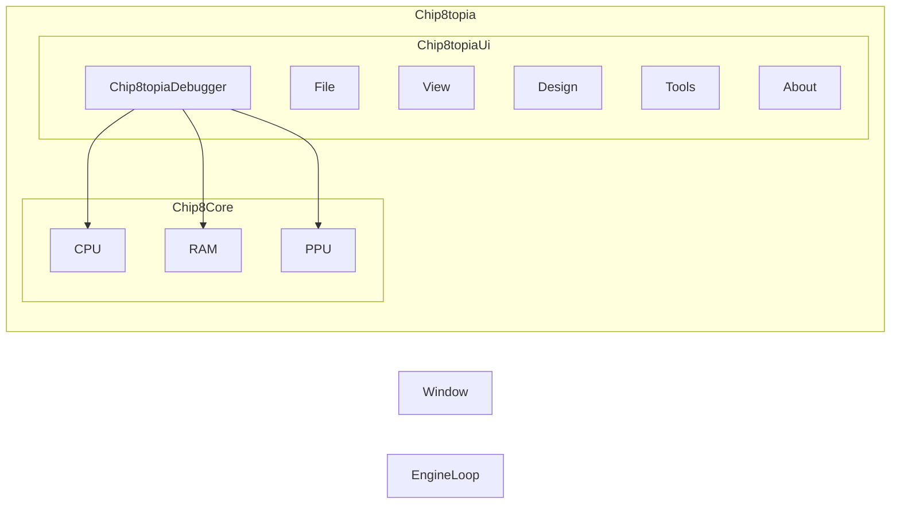

# Chip8topia

https://en.wikipedia.org/wiki/CHIP-8#Further_reading

## TODO

- [ ] Add glad init in Chip8topia.cpp
- [ ] Code the Chip8Core
- [ ] Link the code from Chip8Core to Chip8topiaDebugger and Chip8topiaUi

Le code ImGui de debug Chip8 n'est pas intégré au Chip8Core pour des raisons de portabilité.
On est pas sur un moteur de jeu, il est donc préferrable de laisser imgui dans des classes séparées et dans ces classes
d'envoyer les données à afficher à imgui.
<!--

%%ROM

%% C --> CC
CC --> CPU
CC --> RAM
CC --> ROM
CC --> PPU

C[Chip8topia]

CC[Chip8Core]
CPU[CPU]
RAM[RAM]
ROM[ROM]
PPU[PPU]

-->
