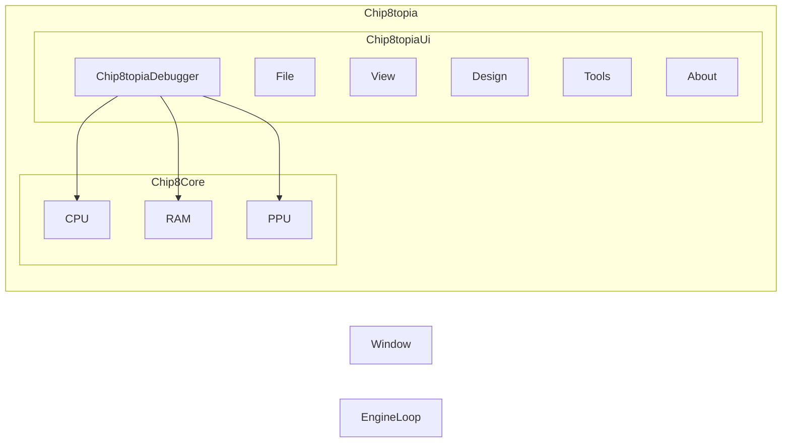

# Chip8topia

https://en.wikipedia.org/wiki/CHIP-8#Further_reading

## TODO

- [x] Add glad init in Chip8topia.cpp
- [x] Code the Chip8Core
- [ ] Code the Chip8topiaUi
- [ ] Code the Chip8topiaDebugger
- [x] Add a file explorer to load roms
- [ ] Handle file open dialog for multiple platforms (Windows, Linux, Mac), maybe use a library like GTK or WxWidgets
- [ ] Add emulation video
- [ ] Add emulation sound
- [ ] Link emulator inputs and UI inputs
- [ ] Améliorer code imgui des fenêtres avec un système qui contiendrait les enums des fenêtres à afficher, ensuite en
  allant dans un switch case pour chaque enum dans le tableau, on afficherait la fenêtre correspondante

<!--

%%ROM

%% C --> CC
CC --> CPU
CC --> RAM
CC --> ROM
CC --> PPU

C[Chip8topia]

CC[Chip8Core]
CPU[CPU]
RAM[RAM]
ROM[ROM]
PPU[PPU]

-->

## Dependencies

- [GLFW](https://www.glfw.org/)
- [GLAD](https://glad.dav1d.de/)
- [ImGui](https://github.com/ocornut/imgui)
- [ImGuiFileDialog](https://github.com/aiekick/ImGuiFileDialog)
- [ImGui Memory Editor](https://github.com/ocornut/imgui_club/tree/main/imgui_memory_editor)
- [tinyfiledialogs](https://sourceforge.net/projects/tinyfiledialogs/)
